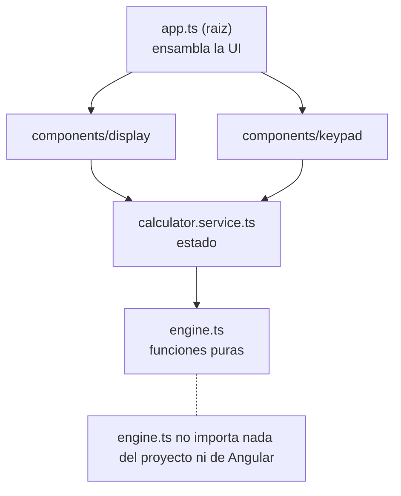
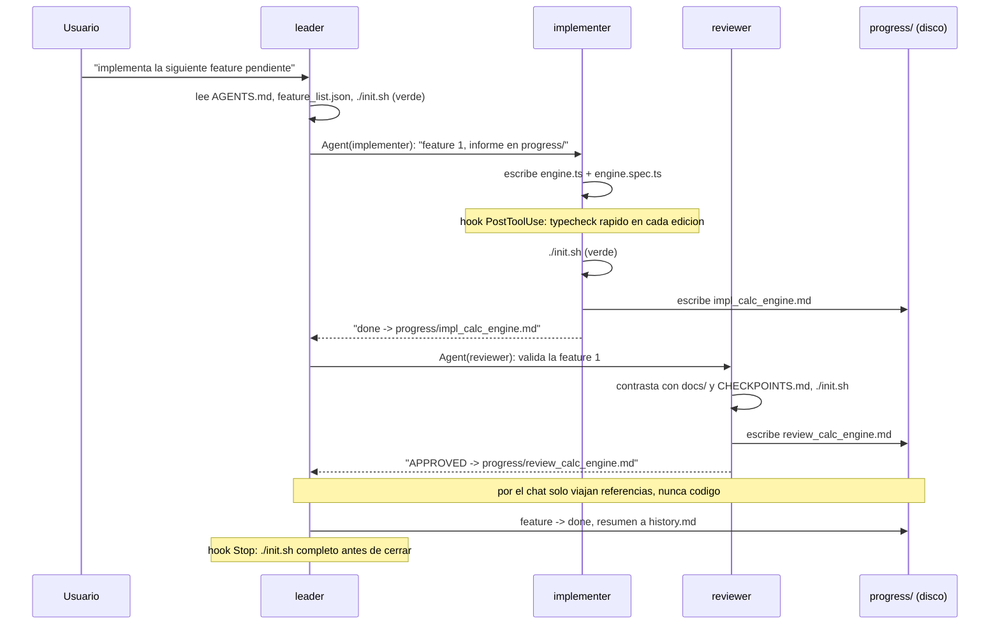
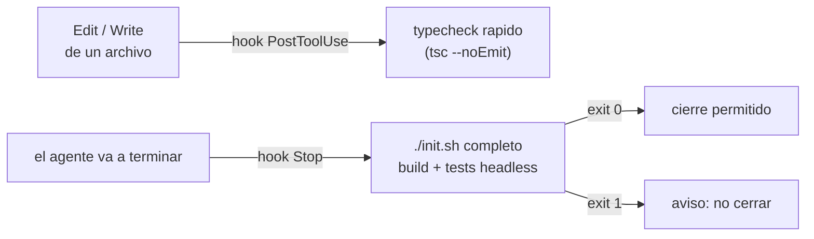
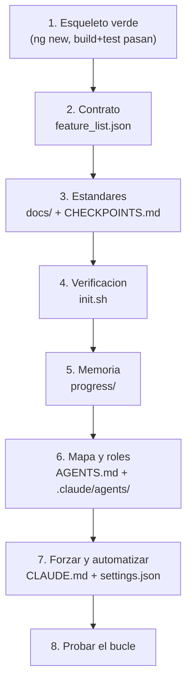

# calculator — ejemplo de Harness Engineering

Calculadora en Angular usada como ejemplo didactico de **ingenieria de arneses**
(harness engineering). El codigo de la app es deliberadamente simple: lo
importante no es **que** hace, sino **como** esta estructurado el repositorio
para que un agente de IA pueda trabajar de forma autonoma, acotada y verificable.

---

## Que es un arnes

Un arnes convierte "confio en que el agente lo hizo bien" en "el sistema
demuestra que esta bien". Todo lo que hay en este repo sirve a uno de tres
objetivos:

- **Acotar el trabajo** (el contrato).
- **Separar poderes** (los roles).
- **Verificar sin fe** (la ejecucion forzada).

## Estructura del repositorio

```
calculator/
├── CLAUDE.md               fuerza el rol leader al abrir el repo
├── AGENTS.md               mapa de navegacion (divulgacion progresiva)
├── CHECKPOINTS.md          criterios objetivos C1-C5 del estado final
├── feature_list.json       contrato: features con estado, una a la vez
├── init.sh                 verificacion ejecutable (entorno + JSON + build + test)
├── docs/
│   ├── architecture.md     capas y direccion de dependencias
│   ├── conventions.md      estilo TS/Angular, nombres, manejo de errores
│   └── verification.md     comandos canonicos y como demostrar que funciona
├── progress/
│   ├── current.md          estado de la sesion activa (se sobrescribe)
│   └── history.md          bitacora append-only (nunca se borra)
├── .claude/
│   ├── agents/             leader · implementer · reviewer
│   └── settings.json       hooks de verificacion + permisos
└── src/app/                la app Angular (baseline verde)
```

## Los tres pilares

| Pilar | Manifestacion en este repo |
|-------|----------------------------|
| 1. El repositorio ES el sistema | `AGENTS.md`, `init.sh`, `feature_list.json`, `progress/`, `docs/` |
| 2. Orquestacion multi-agente    | `.claude/agents/leader.md`, `implementer.md`, `reviewer.md` |
| 3. Supervision y verificacion   | `CHECKPOINTS.md`, hooks en `.claude/settings.json`, `init.sh` |

## Arquitectura de la app y direccion de dependencias

Las dependencias solo van en una direccion. Ningun componente contiene logica
aritmetica propia: esa vive en el motor.



El orden de las features en `feature_list.json` respeta este grafo: el motor
antes que el servicio, el servicio antes que la UI.

## El bucle: lider, implementer, reviewer

La idea mas potente del arnes es la **separacion de poderes**, impuesta
tecnicamente restringiendo el campo `tools` de cada agente:

| Rol | Tools | Poder que NO tiene |
|-----|-------|--------------------|
| leader | Read, Glob, Grep, Bash, Agent | no edita codigo |
| implementer | + Write, Edit | no se autoaprueba (`done`) |
| reviewer | Read, Glob, Grep, Bash | no edita codigo (solo juzga) |



Regla anti-telefono-descompuesto: los subagentes escriben sus resultados en
archivos y solo devuelven una referencia ligera. El codigo no circula por el
chat, donde se degradaria entre niveles.

## Verificacion forzada

`init.sh` es el unico componente que no acepta la palabra del agente: ejecuta y
mira el exit code. Los hooks de `.claude/settings.json` lo disparan
automaticamente, asi que no se pueden saltar:



Patron general de fricciones: feedback barato y frecuente (typecheck en cada
edicion) + verificacion cara y puntual (suite headless solo al cerrar). Nunca
pongas tu verificacion mas lenta en el bucle mas frecuente.

## Como construir un arnes como este (orden de dependencias)



Lo unico que cambia entre stacks son los comandos dentro de `init.sh` y los
hooks; la estructura es identica.

## Los cinco principios transferibles

1. **Acota el trabajo.** Un contrato explicito con criterios verificables, una
   unidad a la vez. Sin esto, el agente "ayuda" sin limite.
2. **Verifica, no confies.** `init.sh` ejecuta y mira el exit code; la palabra
   del agente no cuenta.
3. **Separa poderes tecnicamente.** Roles con `tools` restringidas: quien
   implementa no se aprueba, quien revisa no arregla. No es confianza, es
   imposibilidad.
4. **Estado en disco, no en chat.** `progress/` sobrevive a reinicios y a
   ventanas de contexto reventadas.
5. **Automatiza lo que no debe saltarse.** Hooks ejecutados por el harness, no
   por el agente.

---

## Uso (humanos)

```bash
npm install        # primera vez
./init.sh          # verificacion completa: debe terminar en exit 0
npm start          # servidor de desarrollo en http://localhost:4200/
npm run build      # build de produccion
npm run test:ci    # tests en Chrome headless
```

## Probarlo con Claude Code

Abre Claude Code en esta carpeta (`calculator/`). `CLAUDE.md` te pone como
`leader` automaticamente. Pidele: "implementa la siguiente feature pendiente".
Veras al leader lanzar un implementer y un reviewer; por el chat solo pasan
referencias del tipo `done -> progress/impl_<feature>.md`, mientras los informes
aparecen en `progress/` en disco.
